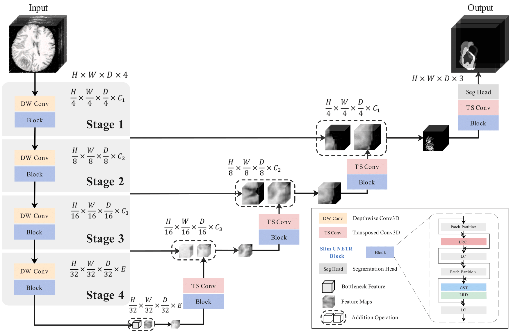
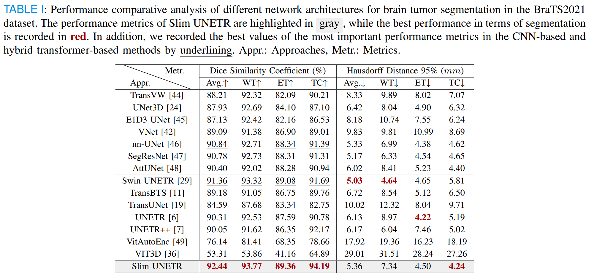
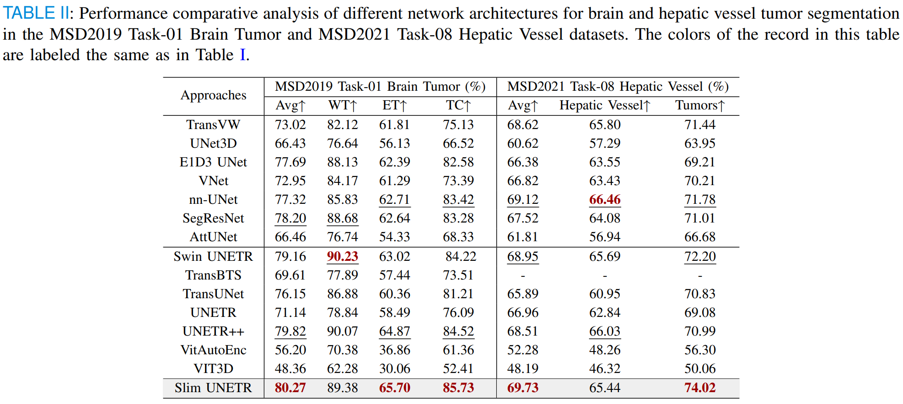
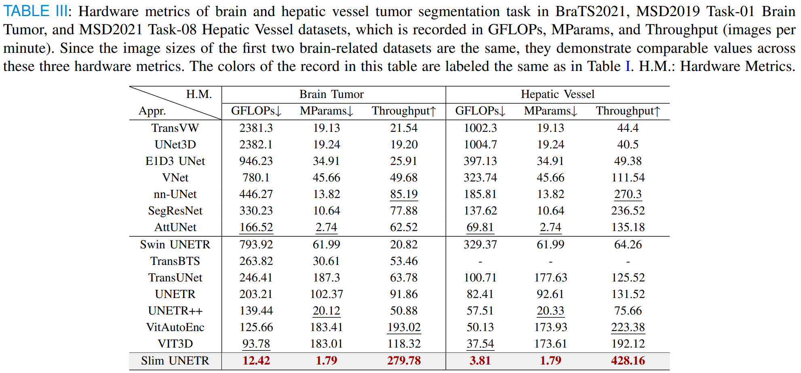
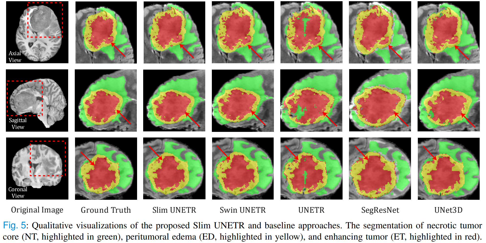

# Slim UNETR: An Efficient, High-Quality 3D Segmentation for Medical Image Analysis with Constrained Computational Resources

> 🎉 This work is accepted by [IEEE Transactions on Medical Imaging](https://ieeexplore.ieee.org/document/10288609)

# Network Architecture



# Data Description
### Dataset Name: BraTS2021

Modality: MRI

Size: 1470 3D volumes (1251 Training + 219 Validation)

Challenge: RSNA-ASNR-MICCAI Brain Tumor Segmentation (BraTS) Challenge

- Register and download the official BraTS 21 dataset from the link below and place then into "TrainingData" in the dataset folder:

  https://www.synapse.org/#!Synapse:syn27046444/wiki/616992

The sub-regions considered for evaluation in BraTS 21 challenge are the "enhancing tumor" (ET), the "tumor core" (TC), and the "whole tumor" (WT). The ET is described by areas that show hyper-intensity in T1Gd when compared to T1, but also when compared to “healthy” white matter in T1Gd. The TC describes the bulk of the tumor, which is what is typically resected. The TC entails the ET, as well as the necrotic (NCR) parts of the tumor. The appearance of NCR is typically hypo-intense in T1-Gd when compared to T1. The WT describes the complete extent of the disease, as it entails the TC and the peritumoral edematous/invaded tissue (ED), which is typically depicted by hyper-intense signal in FLAIR [[BraTS 21]](http://braintumorsegmentation.org/).


### Dataset Name: MSD2019 Task-01 Brain Tumor

Modality: MRI

Size: 484 3D volumes (387 Training + 97 Validation)

Challenge: Medical Segmentation Decathlon Brain Tumor Segmentation Challenge

- Register and download the official MSD2019 Task-01 Brain Tumor dataset from the link below and record its data place in config.brain2019.data_root:

  http://medicaldecathlon.com/

The No.1 task dataset of Medical Segmentation Decathlon (MSD) 2019 is selected to test the versatility of our approaches, which contains 484 data samples, each comprising four 3D MRI modalities that are the same as the BraTS2021 dataset and ground truth labels for glioma segmentation, including necrotic/active tumor and edema, are employed for training the model.

### Dataset Name: MSD2021 Task-08 Hepatic Vessel

Modality: MRI

Size: 303 3D volumes (242 Training + 61 Validation)

Challenge: Medical Segmentation Decathlon Hepatic Vessel and Tumor Segmentation Challenge

- Register and download the official MSD2021 Task-08 Hepatic Vessel dataset from the link below and record its data place in config.brain2019.data_root:

  http://medicaldecathlon.com/

The No.8 task dataset of MSD2021 is selected to test the versatility of our approaches, which contains 303 CT images of hepatic vessels. The segmentation objection of testing each sample is to accurately segment hepatic vessel and tumor targets.


# Training
The ```config.yml``` is the global parameters control file. Dataset loading and related parameter selection are controlled through the three bool variables of ```is_brats2021```, ```is_brain2019```, and ```is_hepatic_vessel2021``` in ```config.yml```.

A Slim UNETR network (BraTS2021 and MSD2019 Task-01 Brain Tumor dataset) with standard hyperparameters for 3D tumor semantic segmentation is defined as:
``` bash
model = SlimUNETR(in_channels=4, 
                  out_channels=3, 
                  embed_dim=96,
                  embedding_dim=64, 
                  channels=(24, 48, 60),
                  blocks=(1, 2, 3, 2), 
                  heads=(1, 2, 4, 4), 
                  r=(4, 2, 2, 1), 
                  dropout=0.3
                  )
```
In addition, the Slim UNETR (MSD2021 Task-08 Hepatic Vessel dataset) is defined as:
``` bash
model = SlimUNETR(in_channels=1,
                  out_channels=2,
                  embed_dim=96 ,
                  embedding_dim=27 ,
                  channels=(24, 48, 60),
                  blocks=(1, 2, 3, 2),
                  heads=(1, 2, 4, 4),
                  r=(4, 2, 2, 1),
                  dropout=0.3
                  )
```
Specifically, users can modify the model for different datasets in the ```  config.yml ```.

## Training from scratch on single GPU
Adjust specific training parameters in ```  config.yml ```, and:
``` bash
python3 main.py
```

## Training from scratch on multi-GPU
Adjust the specific training parameters in ```config.yml``` and decide the devices in ```train.sh```, and:
``` bash
sh train.sh
```

# Evaluation
Evaluate the segmentation performance of Slim UETR on a single GPU: 
``` bash
python3 inference.py
```
Evaluate the hardware performance consumption of Slim UNETR:
``` bash
python3 weight_test.py
```

# Results






# Visualization


# Bixtex
```bib
@ARTICLE{10288609,
  author={Pang, Yan and Liang, Jiaming and Huang, Teng and Chen, Hao and Li, Yunhao and Li, Dan and Huang, Lin and Wang, Qiong},
  journal={IEEE Transactions on Medical Imaging}, 
  title={Slim UNETR: Scale Hybrid Transformers to Efficient 3D Medical Image Segmentation Under Limited Computational Resources}, 
  year={2023},
  volume={},
  number={},
  pages={1-1},
  doi={10.1109/TMI.2023.3326188}}
```